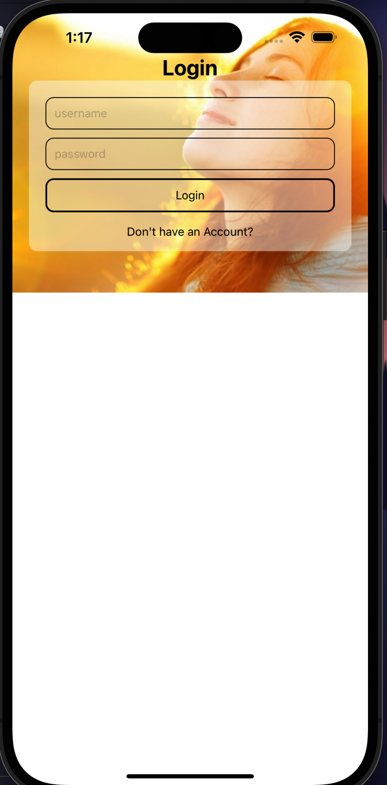

<h1>Tokenization: A React Native Application</h1>

This application is primarly focused on creating a successfull applicaition that grants the users a successfull token if they scan it with their camera. And the session will be recorded in a JSON-server database.

<h2> Stacks Used </h2>

<ol style="display:flex; gap: 2rem ; flex-wrap:wrap; ">
<li> Node JS </li>
<li> React JS </li>
<li> Express JS </li>
<li> Mongooss JS </li>
<li> Python </li>
</ol>

<h2> Installation Process</h2>

Since this stack uses nodejs ( Javascript ) as its source we will be using node in its entirity. to run the application follow the step by sep guideline on how to do it.

```shell
npm i
```

```shell
npx expo start
```

<h3>Andriod</h3>

```shell
npm run android
```

<h3>IOS</h3>

```shell
npm run ios
```

<h3>Web</h3>

```shell
npm run web
```

<h2> Owners </h2>
<ul>
<li><a href="http://github.com/uniquemozilla22" >Takeo</a></li>
<li>Yogesh Bhattarai</li>
</ul>


